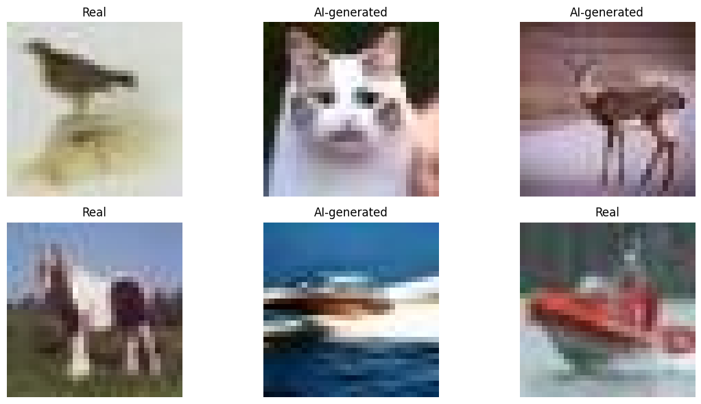
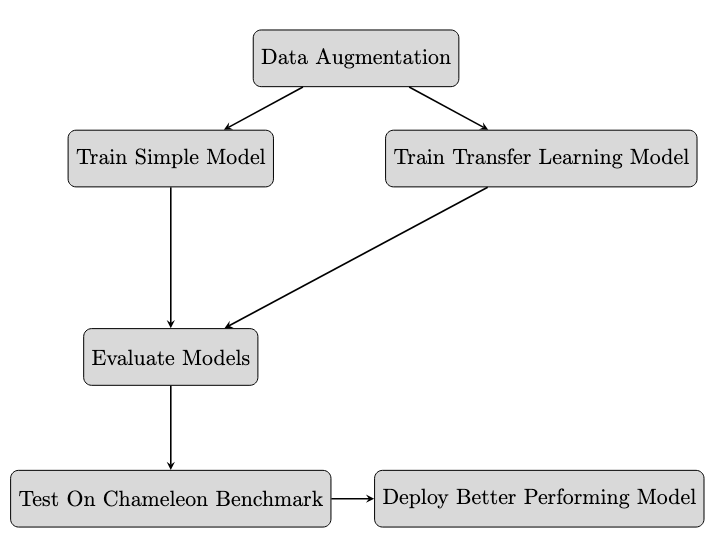
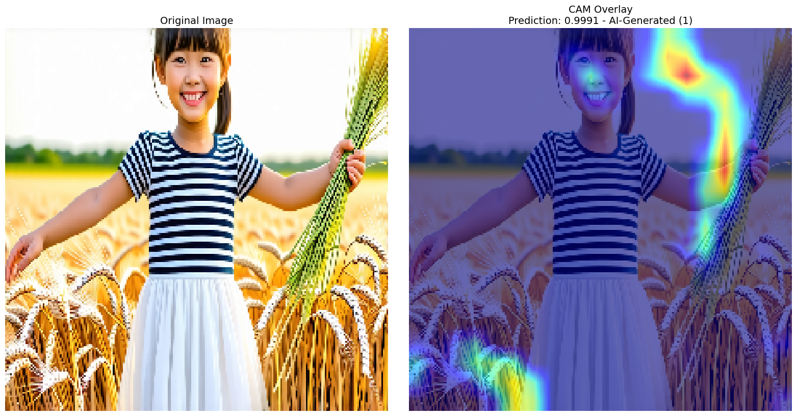
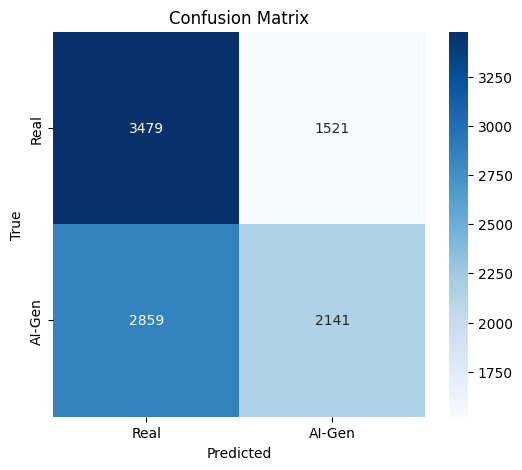
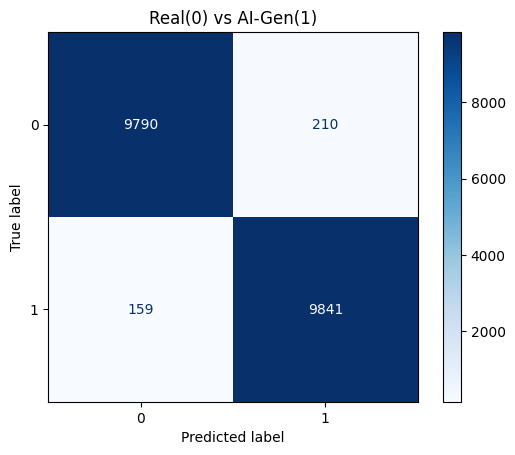
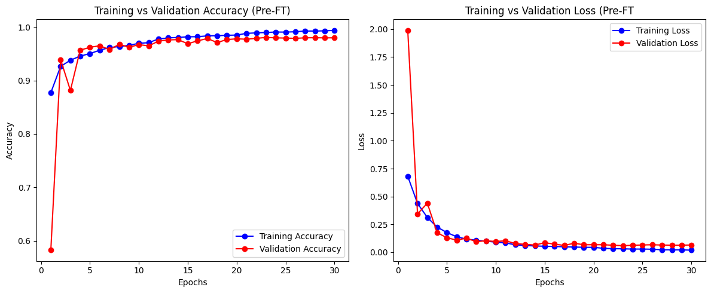
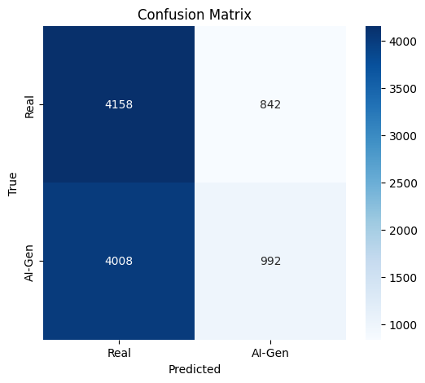

# AI-Generated Image Detector

This project aims to*detect AI-generated images using deep learning techniques. With the rapid rise of generative models, distinguishing between real and AI-generated images has become an increasingly important and challenging task.  
Our detector uses a convolutional neural network (CNN) trained on real and AI-generated images to classify whether an input image is **real** or **AI-generated**.


*Source: https://photutorial.com/ai-image-generators-transforming-stock-photo-industry/*

---

## Table of Contents
- [Overview](#overview)
- [Dataset](#dataset)
- [Methodology](#methodology)
- [Results](#results)
  - [Simple Model](#simple-model)
    - [Simple Model Metrics](#simple-model-metrics)
    - [Simple Model Visualization (Grad-CAM)](#visualization-grad-cam-simple)
    - [Simple Model Chameleon Benchmark](#testing-on-chameleon-dataset-simple)
  - [Transfer Learning Model](#transfer-learning-model)
    - [Transfer Model Metrics](#transfer-model-metrics)
    - [Transfer Model Visualization (Grad-CAM)](#visualization-grad-cam-trasnfer)
    - [Transfer Model Chameleon Benchmark](#testing-on-chameleon-dataset-transfer)
- [Installation](#installation)

---

## Overview
This project focuses on **binary image classification**:
- **Class 0:** Real images (human-taken photos)
- **Class 1:** AI-generated images (synthetic content)

The goal is to explore how well machine learning can differentiate between authentic and synthetic images, and to visualize model decision patterns using **Grad-CAM** heatmaps.

---

## Dataset
The project currently uses the CIFAKE dataset for model training. This is a dataset containing 120,000 (32x32) images:



A benchmark dataset, called the The [**Chameleon Dataset**]([https://chameleon.ait.ethz.ch/](https://github.com/shilinyan99/AIDE)) was used to further evaluate the models. This is a challenging benchmark that contains realistic, inauthentic images that often fool humans. 

---

## Methodology
1. **Model Architecture:**  
   A simple **Convolutional Neural Network (CNN)** was implemented as the baseline detector.

2. **Training:**  
   - Images were resized and normalized.  
   - The model was trained using **binary cross-entropy loss** and **Adam optimizer**.  
   - Early stopping and validation metrics were used to prevent overfitting.

3. **Evaluation Metrics:**  
   - Accuracy  
   - Precision  
   - Recall  
   - F1-score  

4. **Explainability:**  
   Grad-CAM was applied to visualize which image regions influenced the model’s predictions.

5. **Benchmark on Chameleon Dataset:**  
   Each model will be evaluated on the **Chameleon dataset**, which contains images from various generative models (e.g., StyleGAN, Stable Diffusion, DALL·E). 



---

## Results

### Simple Model

#### Simple Model Metrics

Initial experiments with the simple CNN achieved promising accuracy on the validation set.  

| Class   | Precision | Recall | F1-Score | Support |
|---------|-----------|--------|----------|---------|
| Real    | 0.95      | 0.85   | 0.90     | 10000    |
| AI-Gen  | 0.86      | 0.96   | 0.91     | 10000    |

Testing Accuracy: 0.90


---

#### Simple Model Visualization (Grad-CAM)
Grad-CAM was used to produce **class activation maps**, highlighting which parts of the image most strongly influenced the model’s decision.  
This helps interpret model behavior and verify that it focuses on meaningful features (e.g., texture artifacts, background inconsistencies, etc.).



#### Simple Model Chameleon Benchmark
Testing on the Chameleon dataset demonstrated that while the model exhibits poor generalization to unseen generative styles. The results show that the simple model often mistook ai-generated images for authentic ones, achieving a recall of 0.26 for the ai-generated class. 

| Class   | Precision | Recall | F1-Score | Support |
|---------|-----------|--------|----------|---------|
| Real    | 0.51      | 0.77   | 0.61     | 5000    |
| AI-Gen  | 0.52      | 0.26   | 0.34     | 5000    |

Benchmark Testing Accuracy: 0.51



---

### Transfer Model

#### Transfer Model Metrics

Initial experiments with the simple CNN demonstrated excellent performance on the validation set. Achieving a high test accuracy of 0.98, both real and ai-generated imagew were classified with near perfect precision, recall, and F1-scores. 

| Class   | Precision | Recall | F1-Score | Support |
|---------|-----------|--------|----------|---------|
| Real    | 0.98      | 0.98   | 0.98     | 10000    |
| AI-Gen  | 0.98      | 0.98   | 0.98     | 10000    |

Testing Accuracy: 0.98






---

#### Transfer Model Visualization (Grad-CAM)
Grad-CAM was used to produce **class activation maps**, highlighting which parts of the image most strongly influenced the model’s decision.  
This helps interpret model behavior and verify that it focuses on meaningful features (e.g., texture artifacts, background inconsistencies, etc.).


#### Transfer Model Chameleon Benchmark
Testing the transfer model on the Chameleon dataset revealed that it struggles to generalize to unseen data. Although the model achieved high performance on the validation set, it failed to maintain this effectiveness when evaluated on the Chameleon benchmark. The model showed a strong bias toward predicting images as real, with a recall of 0.83 for the real class but only 0.20 for the AI-generated class. This imbalance indicates that while the model can reliably identify authentic images, it performs poorly in detecting AI-generated ones.

| Class   | Precision | Recall | F1-Score | Support |
|---------|-----------|--------|----------|---------|
| Real    | 0.51      | 0.83   | 0.63     | 5000    |
| AI-Gen  | 0.54      | 0.2   | 0.29     | 5000    |

Benchmark Testing Accuracy: 0.52



## Installation
 ```bash
git clone https://github.com/ckelly27/DSC599_Capstone.git
cd DSC599_Capstone
pip install -r requirements.txt
```

Alternatively, visit this link to the Google Colab document: [Google Colab](https://colab.research.google.com/drive/1AUaz-ZqG27AqcERgQnWXXZv8bhOnhyNp#scrollTo=KdxeiS3QVYR4)

