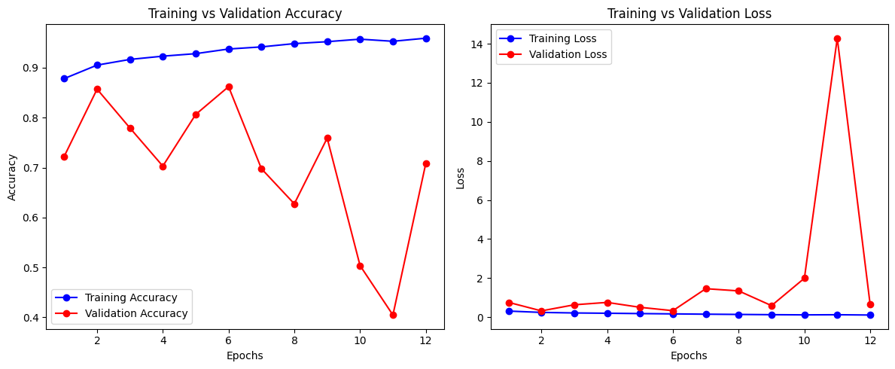

# AI-Generated Image Detector

This project aims to*detect AI-generated images using deep learning techniques. With the rapid rise of generative models, distinguishing between real and AI-generated images has become an increasingly important and challenging task.  
Our detector uses a convolutional neural network (CNN) trained on real and AI-generated images to classify whether an input image is **real** or **AI-generated**.

*Source: https://photutorial.com/ai-image-generators-transforming-stock-photo-industry/*

---

## Table of Contents
- [Overview](#overview)
- [Dataset](#dataset)
- [Methodology](#methodology)
- [Results](#results)
- [Visualization (Grad-CAM)](#visualization-grad-cam)
- [Testing on Chameleon Dataset](#testing-on-chameleon-dataset)
- [Installation](#installation)
- [Usage](#usage)
- [Future Work](#future-work)
- [Acknowledgments](#acknowledgments)

---

## Overview
This project focuses on **binary image classification**:
- **Class 0:** Real images (human-taken photos)
- **Class 1:** AI-generated images (synthetic content)

The goal is to explore how well machine learning can differentiate between authentic and synthetic images, and to visualize model decision patterns using **Grad-CAM** heatmaps.

---

## Dataset
The project currently uses:
- **Training data:** A curated mix of real and AI-generated images.
- **Testing data:** The [**Chameleon Dataset**]([https://chameleon.ait.ethz.ch/](https://github.com/shilinyan99/AIDE)) — a challenging benchmark designed for detecting generated content.

The Chameleon dataset includes both real and AI-generated samples produced by multiple modern generative models, providing a diverse test set.

---

## Methodology
1. **Model Architecture:**  
   A simple **Convolutional Neural Network (CNN)** was implemented as the baseline detector.

2. **Training:**  
   - Images were resized and normalized.  
   - The model was trained using **binary cross-entropy loss** and **Adam optimizer**.  
   - Early stopping and validation metrics were used to prevent overfitting.

3. **Evaluation Metrics:**  
   - Accuracy  
   - Precision  
   - Recall  
   - F1-score  

4. **Explainability:**  
   Grad-CAM was applied to visualize which image regions influenced the model’s predictions.

---

## Results
Initial experiments with the simple CNN achieved promising accuracy on the validation set.  
Testing on the Chameleon dataset demonstrated that while the model generalizes somewhat to unseen generative styles, additional fine-tuning and data augmentation are needed for robustness.

| Metric | Value |
|--------|--------|
| Testing Accuracy | 0.8512 |
| Test Accuracy (Chameleon) | 0.5620 |

---

## Visualization (Grad-CAM)
Grad-CAM was used to produce **class activation maps**, highlighting which parts of the image most strongly influenced the model’s decision.  
This helps interpret model behavior and verify that it focuses on meaningful features (e.g., texture artifacts, background inconsistencies, etc.).

## Testing on Chameleon Dataset
The trained model was evaluated on the **Chameleon dataset**, which contains images from various generative models (e.g., StyleGAN, Stable Diffusion, DALL·E).  
Results suggest the model detects many AI-generated patterns but struggles with highly photorealistic synthetic images.

